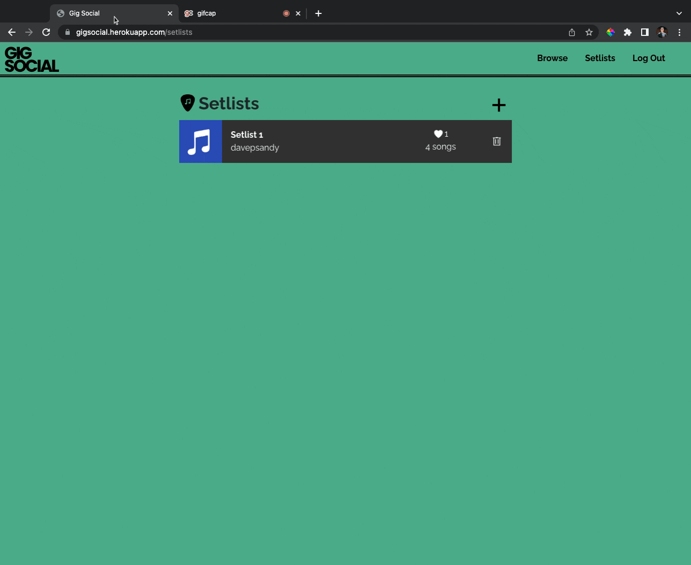

# gigSocial

gigSocial is an app inspired by the struggles of being a musician. The app helps musicians organize their setlists, lyrics, and tempos in one place. gigSocial allows users to create accounts, connect them to the Genius API, and build setlists of songs for live performances. Additionally, each song can have a set BPM (beats per minute). The included metronome pulses at the tempo of each song in the setlist to provide a visual cue for live performance.

gigSocial also includes a small amount of social networking; other users of the app are able to view other setlists on the app and comment their own opinions.

## Installation

1. First, clone the repository

2. Run `npm install` in the root directory

3. You will have to sign up as a client for the Genius API in order to use their services. Information about this can be found [here](https://docs.genius.com/).

4. A .env file is required, see the .ENV_EXAMPLE file in the server folder for reference. The app requires variables related to the GENIUS API client and also for JSON web tokens.

5. The redirect uri parameter in the variable body in Profile.js will have to be changed to `http://localhost:3000/setlists` during development.

## Technologies

1. MongoDB Atlas with Mongoose
2. GraphQL API with Apollo
3. Node
4. Express
5. React
6. Genius API
7. OAuth 2.0 for interacting with the Genius API
8. JSON Web Tokens
9. Styled Components
10. Bootstrap CSS
11. Netlify
12. Render

## Live site

The live site is viewable [here](https://gigsocial.netlify.app/). It will require you to sign up for gigSocial account and a free Genius account in order to search the app.  The front end is hosted on Netlify and the back end is hosted on Render.

## Future Developments

- Expand to React Native app to take advantage of mobile gestures and push notifications
- Integrate the Spotify API
- Add more social media features
- Embedded lyrics

Thanks for checking it out!

- Dave
